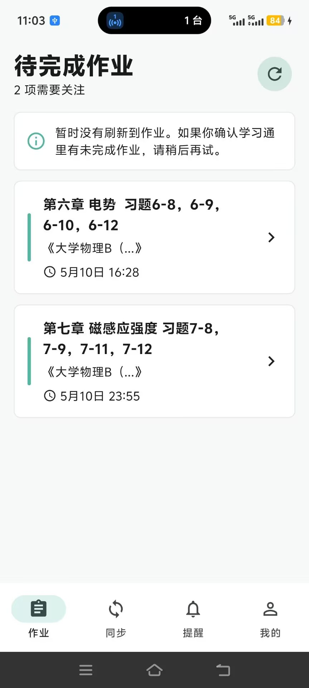
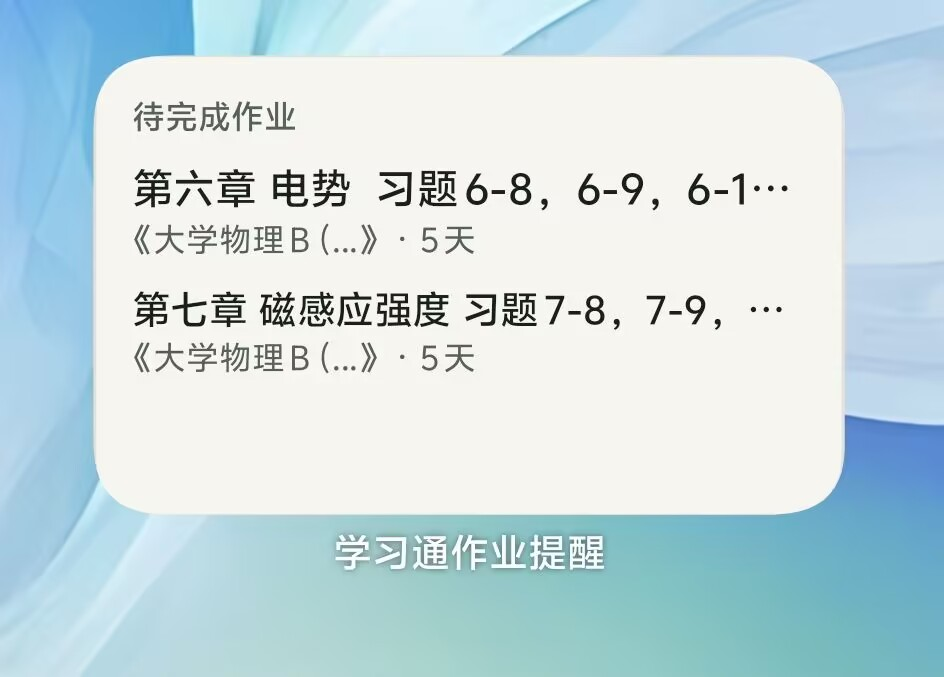

# 学习通作业提醒

学习通作业提醒是一款本地版 Flutter App。用户使用学习通账号密码登录后，App 会在本机同步未完成作业、展示截止时间、安排提醒通知，并把近期待办作业同步到手机桌面小组件。

## 项目信息

- 版权归 HY 所有
- GitHub：https://github.com/mshzy/study_assistant
- 当前版本：1.0.3
- 开源协议：MIT License，详见 [LICENSE](LICENSE)

## 预览

| 作业列表 | 桌面小组件 |
| --- | --- |
|  |  |

## 已实现能力

- 学习通账号密码登录，凭证仅保存在本机安全存储。
- 本地同步学习通作业，只展示未完成作业。
- 支持作业详情、返回主页、手动标记完成；手动完成后再次刷新不会重新显示。
- 未完成互评作业保留，已完成/已互评作业自动过滤。
- 支持自定义提醒时间，可添加、删除并保存多个提前提醒规则。
- 支持本地系统通知，包含开机后恢复已安排提醒。
- 支持 Android 桌面小组件，显示近期待完成作业、课程名和剩余时间。
- 小组件点击可直接进入对应作业详情；旧版 deep link 也已兼容。
- “关于应用”展示版权、开源协议和 GitHub 源码入口。

## 隐私说明

- 学习通账号密码和作业数据只保存在本机，不会上传到任何服务器。
- 不绕过学习通验证码、风控或加密保护。
- 小组件不直接访问学习通或后端，只显示 App 写入的本地共享快照。

## 本地版运行

```powershell
cd D:\code\study_assistant\local_app
flutter pub get
flutter run
```

构建 APK：

```powershell
cd D:\code\study_assistant\local_app
flutter build apk --release
```

## 开源协议

本项目采用 MIT License 开源，版权归 HY 所有。你可以在遵守 MIT License 的前提下使用、复制、修改、合并、发布、分发、再授权或销售本项目副本，但必须在软件副本或主要部分中保留原始版权声明和许可声明。

软件按“原样”提供，不提供任何明示或暗示担保。完整协议文本见 [LICENSE](LICENSE)。
